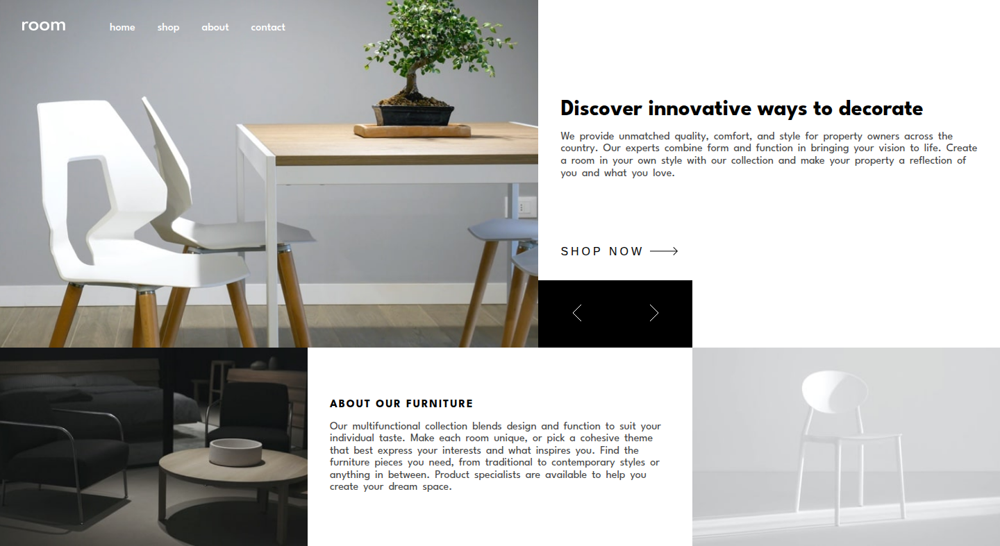

# Frontend Mentor - Room homepage solution

This is a solution to the [Room homepage challenge on Frontend Mentor](https://www.frontendmentor.io/challenges/room-homepage-BtdBY_ENq). Frontend Mentor challenges help you improve your coding skills by building realistic projects. 

## Table of contents

- [Overview](#overview)
  - [The challenge](#the-challenge)
  - [Screenshot](#screenshot)
  - [Links](#links)
- [My process](#my-process)
  - [Built with](#built-with)
  - [What I learned](#what-i-learned)
  - [Continued development](#continued-development)
- [Author](#author)

## Overview

### The challenge

Users should be able to:

- View the optimal layout for the site depending on their device's screen size
- See hover states for all interactive elements on the page
- Navigate the slider using either their mouse/trackpad or keyboard

### Screenshot



### Links

- Solution URL: [View Code](https://github.com/fa23bcs233/room-home-page)
- Live Site URL: [Visit Room](https://fa23bcs233.github.io/room-home-page)

## My process

### Built with

- Semantic HTML5 markup
- CSS custom properties
- Flexbox
- CSS Grid
- Mobile-first workflow

### What I learned

In this project, I faced the challenge of managing two independent sliders using the same control buttons. Writing separate JavaScript logic for each slider would have resulted in lengthy and repetitive code.

💡 That's when I had an idea: use CSS variables to centralize control.

I defined a custom property (--slider-index) for each slider and used it throughout the CSS to handle styling and transformations. Then, instead of writing separate JS logic for each slider, I simply updated their respective CSS variables dynamically via JavaScript.

This approach allowed me to:

✅ Avoid code duplication
✅ Maintain a clean, scalable JavaScript file
✅ Handle all visual updates directly through CSS

By decoupling structure from behavior, I kept the logic DRY and the styles easily customizable. A small trick — but a big architectural win.


```html
        <div class="hero__imageSlider">
          <div class="hero__imageSlider__track">
            <div class="hero__imageSlider__slide">
              <picture>
                <source
                  srcset="./images/desktop-image-hero-1.jpg"
                  media="(min-width: 1024px)"
                />
                
              </picture>
            </div>
            <div class="hero__imageSlider__slide">
              <picture>
                <source
                  srcset="./images/desktop-image-hero-2.jpg"
                  media="(min-width: 1024px)"
                />
                
              </picture>
            </div>
            <div class="hero__imageSlider__slide">
              <picture>
                <source
                  srcset="./images/desktop-image-hero-3.jpg"
                  media="(min-width: 1024px)"
                />
                
              </picture>
            </div>
          </div>
        </div>

        <div class="hero__contentSlider">
          <div class="hero__contentSlider__track">
            <div class="hero__contentSlider__slide hero__contentSlider__slide--active" aria-hidden="false" style="--slide-no:1">
              <h1>Discover innovative ways to decorate</h1>
              <p>
                We provide unmatched quality, comfort, and style for property
                owners across the country. Our experts combine form and function
                in bringing your vision to life. Create a room in your own style
                with our collection and make your property a reflection of you
                and what you love.
              </p>
            </div>
            <div class="hero__contentSlider__slide" aria-hidden="true" style="--slide-no:2">
              <h1>We are available all across the globe</h1>
              <p>
                With stores all over the world, it’s easy for you to find
                furniture for your home or place of business. Locally, we’re in
                most major cities throughout the country. Find the branch
                nearest you using our store locator. Any questions? Don’t
                hesitate to contact us today.
              </p>
            </div>
            <div class="hero__contentSlider__slide" aria-hidden="true" style="--slide-no:3">
              <h1>Manufactured with the best materials</h1>
              <p>
                Our modern furniture store provide a high level of quality. Our
                company has invested in advanced technology to ensure that every
                product is made as perfect and as consistent as possible. With
                three decades of experience in this industry, we understand what
                customers want for their home and office.
              </p>
            </div>

            <button class="hero__contentSlider__CTA">
              <span>Shop Now</span>
              <svg width="40" height="12" xmlns="http://www.w3.org/2000/svg">
              </svg>
            </button>
          </div>
        </div>
```
```css

.hero__imageSlider__track{
    display: flex;
    width: 100%;
    height: 100%;
    transition: var(--slider-transition);
    transform: translateX(calc(-100% * (var(--current-slide-no) - 1)));
}

```
```js
class Slider{
    constructor(slider, sliderItems, sliderNext, sliderPrev){
        this.slider = document.querySelector(slider);
        this.sliderItems = document.querySelectorAll(sliderItems);
        this.sliderNext = document.querySelector(sliderNext);
        this.sliderPrev = document.querySelector(sliderPrev);
        this.activeClass = sliderItems.replace('.', '') + '--active';
        this.currentSlide = 0;

        this.init();
    }

    init(){
        this.sliderNext.addEventListener('click', () => {
            this.nextSlide();
        });

        this.sliderPrev.addEventListener('click', () => {
            this.prevSlide();
        });
    }

    nextSlide(){
        if(this.currentSlide == this.sliderItems.length - 1) return;

        const currentSlide = this.sliderItems[this.currentSlide];
        currentSlide.classList.remove(this.activeClass);

        this.currentSlide++;
        const nextSlide = this.sliderItems[this.currentSlide];
        nextSlide.classList.add(this.activeClass);

        // Update the CSS custom property
        this.slider.style.setProperty('--current-slide-no', this.currentSlide + 1);
    }

    prevSlide(){
        if(this.currentSlide == 0) return;

        const currentSlide = this.sliderItems[this.currentSlide];
        currentSlide.classList.remove(this.activeClass);

        this.currentSlide--;
        const nextSlide = this.sliderItems[this.currentSlide];
        nextSlide.classList.add(this.activeClass);

        this.slider.style.setProperty('--current-slide-no', this.currentSlide + 1);
    }
}
```

### Continued development

Currently, I've implemented a basic slider to demonstrate the functionality and structure.

📌 Next step: I'm planning to enhance it by making it infinite, which will give the UI a more modern and dynamic feel. This improvement will involve seamless looping — where the end transitions smoothly back to the start — without noticeable jumps.

The goal is to provide a fluid user experience that feels continuous and natural.

## Author

- Website - [Visit Portfolio](https://fa23bcs233.github.io/portfolio)
- Frontend Mentor - [@fa23bcs233](https://www.frontendmentor.io/profile/fa23bcs233)
- Twitter - [@arhamrafiq831](https://www.twitter.com/arhamrafiq831)
- LinkedIn - [arham-rafiq](https://www.linkedin.com/in/arham-rafiq-a599a22b1/)
